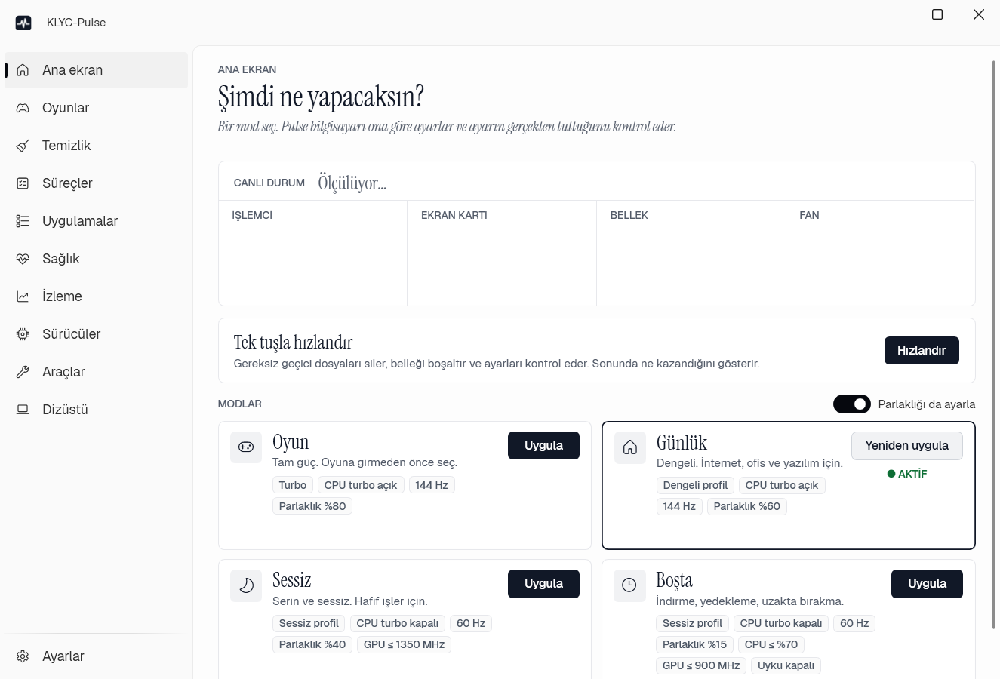
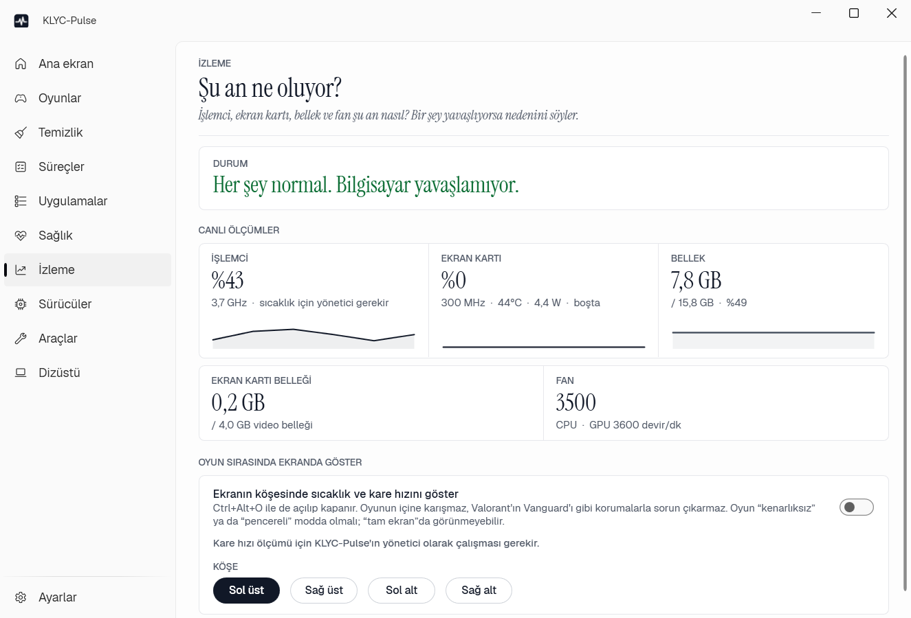
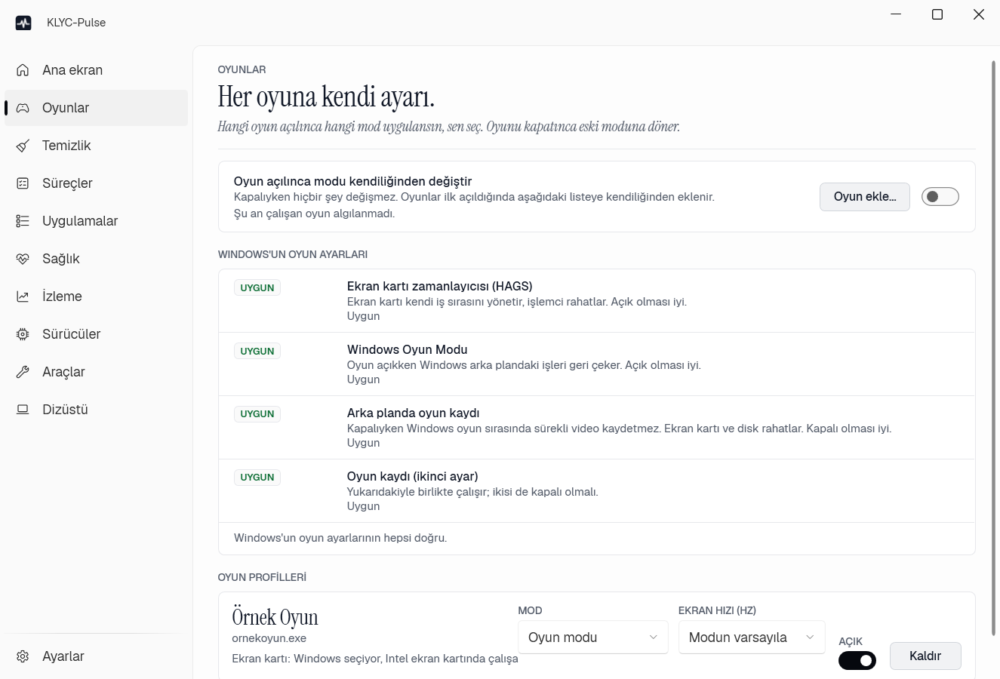

<div align="center">


# KLYC-Pulse

**One window for performance, thermals, battery and maintenance on a Windows gaming PC.**
Every setting it applies is read back to confirm it really took effect.

[](https://github.com/ernklyc/klyc-pulse/releases)
[](https://github.com/ernklyc/klyc-pulse/actions/workflows/build.yml)


[Türkçe](README.md) · **English**



</div>

---

> **Note:** the app UI is currently **Turkish only**. This README is a full English description of the project; localisation contributions are welcome.

## Contents

[Why](#why) · [Features](#features) · [Download and install](#download-and-install) · [First use](#first-use) · [Compatibility](#compatibility) · [Safety principles](#safety-principles) · [FAQ](#faq) · [Troubleshooting](#troubleshooting) · [Build from source](#build-from-source) · [Uninstall](#uninstall) · [Contributing](#contributing) · [License](#license)

## Why

Gaming PCs usually need several separate tools: G-Helper / Armoury Crate for performance profiles, MSI Afterburner / ThrottleStop for monitoring and tuning, vendor helpers for drivers, a cleaner for maintenance. **KLYC-Pulse brings the day-to-day jobs of all of them into one app.** The goal is the best possible performance while gaming and protecting hardware lifespan.

Design principle: **apply → read back → verify.** Values that cannot be read back (for example some battery limits) are reported honestly as "accepted", never as "verified".

## Features

| Page | What it does |
|---|---|
| **Home** | 4 modes: **Game, Daily, Quiet, Idle**. One click applies the ASUS profile, CPU boost, max state, energy preference (AC and battery), refresh rate, brightness and GPU clock cap, verifying each step. Live temperature/load card. **Boost**: temp-file cleanup + memory trim + before/after report. |
| **Games** | Switches mode automatically when a game starts and restores it on exit. Per-game profiles, GPU preference (use the NVIDIA GPU), process priority. Checks and fixes Windows game settings (HAGS, Game Mode, game capture). **Game report:** during a game it records temperatures, CPU clock, GPU throttling, memory and FPS, then explains in plain language what caused stutter and what limits the game, and tunes a per-game CPU frequency cap by itself when it makes sense (compared against the next session; reverted and locked if FPS drops noticeably). |
| **Cleanup** | Finds and removes harmless temporary files; risky ones wait 7 days in quarantine. Browser, Steam, Epic, Discord and NVIDIA installer leftovers. **Duplicate files:** finds identical large files, keeps the oldest of each group, sends extras to the Recycle Bin after your confirmation. **Old leftovers:** conservatively finds AppData/ProgramData folders left by apps uninstalled long ago (installed apps, games, system folders and recently used folders are never shown); nothing is deleted automatically, selected folders go to the Recycle Bin. Disk analysis and restore points. Never deletes without confirmation. |
| **Processes** | Groups programs with CPU/memory, close, priority, **Eco mode** (EcoQoS). Windows, security and anti-cheat processes are protected. |
| **Apps** | winget updates, uninstall (leftovers go to the Recycle Bin), startup items, background services and scheduled tasks. |
| **Health** | Battery (wear, history), thermals, fans, disk health, in plain language. |
| **Monitor** | CPU/GPU temperature, clocks, power, memory, fans, and why something slowed down. **In-game overlay and FPS** (ETW; no injection, no anti-cheat conflicts). |
| **Drivers** | BIOS and driver versions; scans Windows Update for genuinely newer drivers (read-only). |
| **Tools** | "Does Pulse do this?" table for G-Helper, Afterburner, ThrottleStop, Intel DSA, PC Manager; disable/undo; companion mode. |
| **Hardware** (Laptop page) | GPU overclock (NVIDIA, with automatic search), assignable hotkeys, and vendor modules: battery charge limit, keyboard backlight and RGB (currently the ASUS module). |
| **Settings** | Auto mode, thermal guard, heat target, mode keeper, automatic cleanup. |

<p align="center">
  
  
</p>

**Protective features:** *thermal guard* (switches to Quiet mode if dangerous temperatures persist), *heat target* (a software substitute for fan curves; lowers the CPU's maximum frequency in ~300 MHz steps and trims the GPU clock, only when a limit you set is exceeded), *mode keeper* (repairs power settings changed by other tools, checked every minute).

## Download and install

Get one of two files from the **[Releases](https://github.com/ernklyc/klyc-pulse/releases)** page:

| File | Size | When |
|---|---|---|
| `KLYC-Pulse-v1.6.0-win-x64.zip` | ~11 MB (zip) | If the [.NET 8 Desktop Runtime](https://dotnet.microsoft.com/download/dotnet/8.0) is installed |
| `KLYC-Pulse-v1.6.0-win-x64-self-contained.zip` | ~68 MB (zip) | If you don't want to install anything (runtime included) |

1. Unzip and put `KLYC-Pulse.exe` in any folder (e.g. `C:\Programs\KLYC-Pulse`).
2. Double-click; it asks for **administrator rights** (needed for sensors, GPU and service settings).
3. Optionally enable "Start Pulse with Windows" in Settings.

> **Windows SmartScreen / antivirus warning:** the app is not code-signed yet, so an "Unknown publisher" warning may appear. Compare the SHA-256 hash with `SHA256SUMS.txt` on the release page, or build from source yourself.

```powershell
Get-FileHash .\KLYC-Pulse-v1.6.0-win-x64.zip -Algorithm SHA256
```

## First use

1. Pick a mode on **Home**: **Game** for gaming, **Daily** for everyday work.
2. On **Games**, enable "Switch mode automatically when a game starts". Installed games are added the first time they run.
3. On **Laptop** (if supported), choose a battery charge limit; 60–80 % extends battery life if the laptop is always plugged in.
4. If something looks wrong, run the **self-test** (below).

## Compatibility

Works on any Windows 10 (2004+) / 11 x64 PC; **hardware-specific steps are shown as "skipped" when the hardware is missing — they never fail.**

| Feature | Requires |
|---|---|
| Cleanup, apps, processes, startup/service management, driver info, hotkeys | Any Windows PC |
| Modes: power plan (boost, max state, energy preference), refresh rate, brightness | Any PC (brightness depends on the display) |
| GPU monitoring, clock cap, overclock | NVIDIA GPU |
| Vendor module: performance profile, battery charge limit, keyboard backlight | Supported brands: currently ASUS (ATKACPI driver). Modules for other brands can be added |
| Keyboard RGB colour | ASUS TUF models exposing ACPI RGB |
| CPU temperature | System exposing an ACPI thermal zone + administrator |
| FPS | DirectX 10/11/12 games |

Vendor modules are optional: if the hardware is missing the step is skipped and everything else keeps working. Details: [docs/UYUMLULUK.md](docs/UYUMLULUK.md) (Turkish).

## Safety principles

- **Deletion is always confirmed.** Cleanup categories only contain regenerable files; risky ones go to quarantine and can be restored.
- **Reversible.** The "disable other tools" wizard takes a backup and has an Undo button; no program is ever uninstalled.
- **Bounded hardware settings.** GPU overclock ceiling is core +150 / memory +700 MHz and is **not persistent** (resets on mode change, app exit or reboot).
- **Thermal guard.** If dangerous temperatures persist (CPU 97 °C, GPU 90 °C, 10 s) it switches to Quiet mode.
- **Does not touch security settings** (Defender, Memory Integrity, …) and installs no kernel driver.
- **No telemetry.** It touches the network in only three places: (1) at most once a day to ask GitHub for the latest version number (downloads/installs nothing, sends no personal data; can be turned off in Settings > Updates), (2) the winget update check you start, (3) the Windows Update driver scan you start.

## FAQ

**Why administrator rights?** CPU temperature, service/task management, GPU settings and FPS measurement require them on Windows.

**Does it work on other brands?** Yes. Core features (cleanup, processes, apps, power-plan modes, monitoring) work on any PC. Vendor modules (currently ASUS) only activate on the supported brand; new brand modules are welcome contributions.

**Do G-Helper / Armoury Crate need to be open?** No. Pulse is enough on its own. If G-Helper is left running it may fight Pulse; Pulse notices and repairs settings, or you can disable it from the Tools page.

**Undervolt / fan curves?** No. On many systems the BIOS locks them and writing them needs a kernel driver; Pulse does not use unsafe paths. A *heat target* is provided instead.

**Is GPU overclocking safe?** The ceiling is low, it is not persistent, and "Auto find" measures stability and gain first. If you ever see artifacts, choose "Factory" on the Laptop page.

## Troubleshooting

```
KLYC-Pulse.exe --selftest        # quick self-test, ~1 min (live window)
KLYC-Pulse.exe --selftest=gpu    # + GPU auto-tune (~4 min)
```

The result is written to `%USERPROFILE%\KLYC-Pulse-selftest.txt`. The operation log is in `%LOCALAPPDATA%\Pulse\logs`. Attach both to bug reports (they contain no personal data, but please skim before sending).

## Build from source

Requirements: [.NET 8 SDK](https://dotnet.microsoft.com/download/dotnet/8.0), Windows.

```powershell
git clone https://github.com/ernklyc/klyc-pulse.git
cd klyc-pulse
dotnet build -c Release
dotnet publish src/Pulse.App -c Release -r win-x64 --self-contained false -p:PublishSingleFile=true -o dist
# runtime-included single file: --self-contained true
```

Hardware-independent logic tests:

```powershell
dotnet run --project src/Pulse.Cli -c Release -- guard-test
dotnet run --project src/Pulse.Cli -c Release -- governor-test
dotnet run --project src/Pulse.Cli -c Release -- hotkey-test
```

Architecture: [docs/MIMARI.md](docs/MIMARI.md) (Turkish).

## Uninstall

1. Disable "Start Pulse with Windows" in Settings (removes the scheduled task).
2. Exit from the tray icon and delete `KLYC-Pulse.exe`.
3. Optionally delete `%LOCALAPPDATA%\Pulse` (settings, logs, quarantine).

Hardware settings are not persistent and revert on reboot. To restore Windows power-plan values changed by Pulse, reset the plan defaults in Windows power options.

## Contributing

See [CONTRIBUTING.md](CONTRIBUTING.md). Bug reports and hardware compatibility reports (especially other brands/models) are very valuable.

## License

[MIT](LICENSE). Third-party components and fonts: [THIRD-PARTY-NOTICES.md](THIRD-PARTY-NOTICES.md). Security: [SECURITY.md](SECURITY.md).

> This software changes hardware settings. Use at your own risk; no warranty. Brands (ASUS, NVIDIA, Intel, Microsoft, MSI, G-Helper, ThrottleStop) belong to their respective owners; KLYC-Pulse is not affiliated with these companies.
